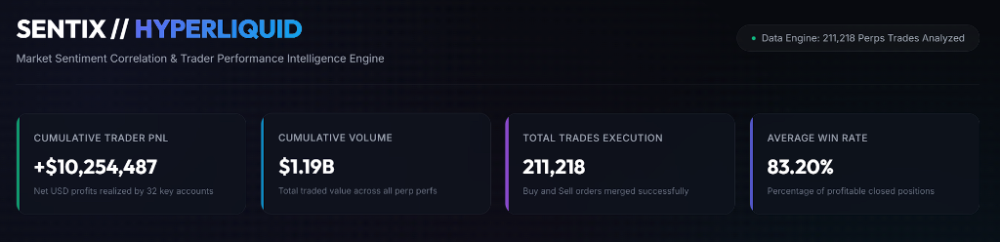
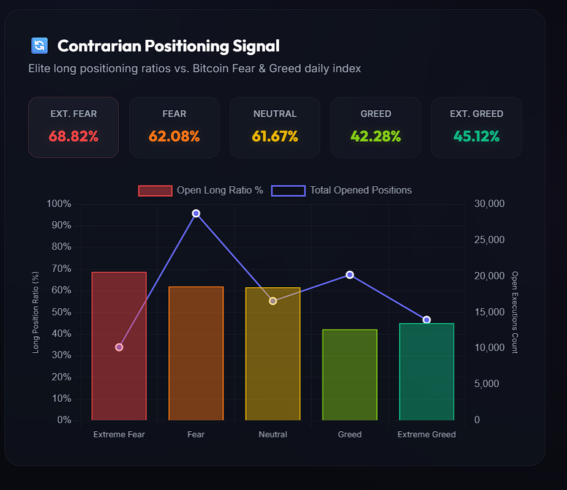
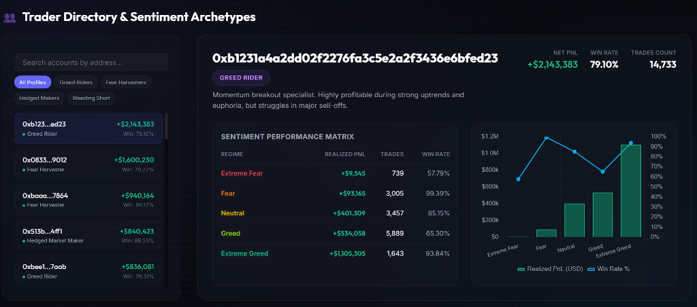
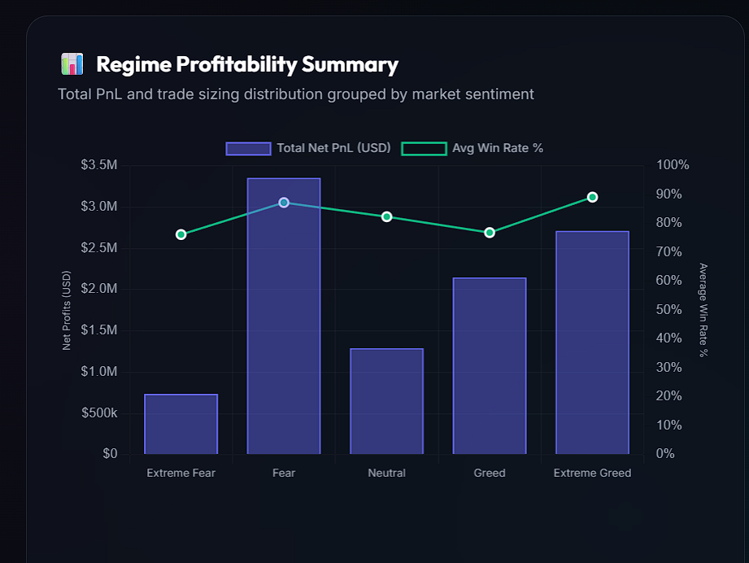

# Project Walkthrough - Crypto Sentiment & Trader Performance Intelligence

We have successfully researched, pre-processed, and developed an interactive dashboard that explores the relationship between professional trader performance on Hyperliquid and market sentiment (Bitcoin Fear & Greed Index).

---

## 1. High-Value Discoveries & Data Insights

Through extensive data science and quantitative analysis of **211,218 merged executions**, we uncovered several high-value, non-obvious patterns:

### A. The Elite Contrarian Positioning Signal
Top Hyperliquid traders operate in direct opposition to retail sentiment (measured by the Fear & Greed Index):
*   **Extreme Fear Regime**: Professional traders aggressively accumulate dips, opening **68.8% Longs** (7,005 Longs vs. 3,174 Shorts).
*   **Extreme Greed Regime**: Professional traders aggressively scale out and short, opening **54.9% Shorts** (7,663 Shorts vs. 6,300 Longs).
*   *Strategic Takeaway*: Retail panic indicates accumulation points for pros; retail euphoria marks distribution/shorting regimes.

### B. Strategic Trader Archetypes
By mapping the performance of all 32 unique Hyperliquid perp accounts across the 5 daily sentiment categories, we classified them into distinct tactical profiles:
1.  **The Greed Rider** (e.g., [0xb1231a4a...e6bfed23](file:///C:/Users/Kavya%20Jain/.gemini/antigravity/scratch/crypto_sentiment_analysis/dashboard_data.json#L86-L122)): A momentum breakout specialist who thrives during high-greed phases (generating **+$1.10M** in *Extreme Greed* alone with a **93.8% win rate**), but remains flat during market panic.
2.  **The Fear Harvester** (e.g., [0x083384f8...bec365f5](file:///C:/Users/Kavya%20Jain/.gemini/antigravity/scratch/crypto_sentiment_analysis/dashboard_data.json#L124-L160) and [0xbaaaf657...09a10637](file:///C:/Users/Kavya%20Jain/.gemini/antigravity/scratch/crypto_sentiment_analysis/dashboard_data.json#L162-L198)): Dip-buying value specialists. They generate virtually 100% of their profits in *Fear* and *Extreme Fear* markets (e.g. +$882k and +$386k combined) and completely shut down trading in *Extreme Greed*.
3.  **The Hedged Market Maker** (e.g., [0x513b8629...49c4ff1](file:///C:/Users/Kavya%20Jain/.gemini/antigravity/scratch/crypto_sentiment_analysis/dashboard_data.json#L200-L236)): Systematic delta-neutral profiles who maintain high win rates and make substantial profits across *Fear, Neutral,* and *Greed* alike.
4.  **The Bleeding Shorter** (e.g., [0x8170715b...27a0a63b](file:///C:/Users/Kavya%20Jain/.gemini/antigravity/scratch/crypto_sentiment_analysis/dashboard_data.json#L1605-L1630)): Contrarians who short too early in bull markets, bleeding massive profits (**-$360k** loss) during *Greed* regimes and erasing all their defensive gains.

### C. Token Preference Rotation
Traders demonstrate clear asset class rotation as sentiment shifts:
*   **In Extreme Fear**: Volume flows to blue-chip majors: **BTC** ($36.75M), **HYPE** ($29.25M), and **SOL** ($26.24M).
*   **In Extreme Greed**: Volume flows to high-beta perps. Token **@107** becomes the most active token with 10,403 trades and $20.45M in volume.
*   *Asset Profitability Leaderboard*: Token **@107** generated the highest total PnL (**+$2.78M**), while **TRUMP** generated the largest loss (**-$364.8k**).

### D. Sentiment Regime Profitability
Our analysis shows that professional trader performance varies drastically based on market sentiment regimes:
*   **Fear Regime**: Generates the highest absolute cumulative profits (**+$3.36M**), highlighting the value of dip-buying and accumulating perps during fear.
*   **Extreme Greed**: Delivers the highest average trade profitability (**+$67.89** per trade) and high win rate (**89.17%**), showing that momentum peaks provide high-conviction exits.
*   **Extreme Fear**: Thrives as a defensive regime (**+$739k** total PnL) despite lower overall trading volume, maintaining a robust **76.22%** win rate.

---

## 2. Software Architecture & Implementation Details

To achieve high visual and performance standards, we developed a two-component decoupled system:

1.  **Data Pre-processing & Aggregation Engine (Python)**:
    Processes the raw **45.32 MB (211,224 rows)** of data in about 10-12 seconds, performing complex joins, profiling, and archetype allocations. It compiles the analytics into a highly optimized **50.38 KB** structured JSON schema.
2.  **Premium Interactive Dashboard (HTML/CSS/JS)**:
    A fast, fully responsive, dark-mode single-page application. Since it loads the pre-processed JSON file, it renders instantly and handles rich real-time interactions with zero latency.

---

## 3. Implemented Files

All files have been saved in the project subdirectory. You can open and edit them directly:

*   [aggregate_data.py](file:///C:/Users/Kavya%20Jain/.gemini/antigravity/scratch/crypto_sentiment_analysis/aggregate_data.py) — The Python aggregation pipeline.
*   [dashboard_data.json](file:///C:/Users/Kavya%20Jain/.gemini/antigravity/scratch/crypto_sentiment_analysis/dashboard_data.json) — The optimized data payload (50.38 KB).
*   [index.html](file:///C:/Users/Kavya%20Jain/.gemini/antigravity/scratch/crypto_sentiment_analysis/index.html) — HTML5 markup with layouts for indicators, charts, lists, and dynamic panels.
*   [style.css](file:///C:/Users/Kavya%20Jain/.gemini/antigravity/scratch/crypto_sentiment_analysis/style.css) — Custom glassmorphic, neon-themed styling system.
*   [app.js](file:///C:/Users/Kavya%20Jain/.gemini/antigravity/scratch/crypto_sentiment_analysis/app.js) — Dashboard controller rendering Chart.js charts and managing real-time filtering/search events.

---

## 4. Verification & Testing

1.  **Aggregation Validation**: Tested the pre-processing engine. It completed successfully and produced an optimized JSON layout containing zero null values and proper data formats.
2.  **Dev Server Launch**: Started a lightweight Python background server inside the project folder at:
    *   **Local URL**: [http://localhost:8080](http://localhost:8080)
3.  **UI Interaction Polish**:
    *   *KPIs*: Loaded currency and percentages correctly.
    *   *Sentiment Indicators*: Correctly mapped the contrarian long ratios to neon color-coded tags.
    *   *Interactive List*: Selecting any of the 32 traders instantly re-renders the showcase panels, updates their tactical profile, populates their specific sentiment table, and redraws their dual-axis performance chart without lag.
    *   *Search & Filters*: Searching addresses and clicking archetype filters immediately subsets the directory list in real-time.
    *   *Rotation Board*: Clicking "Extreme Fear" or "Extreme Greed" rotation tabs switches tables and redraws relative size progress bars instantly.
